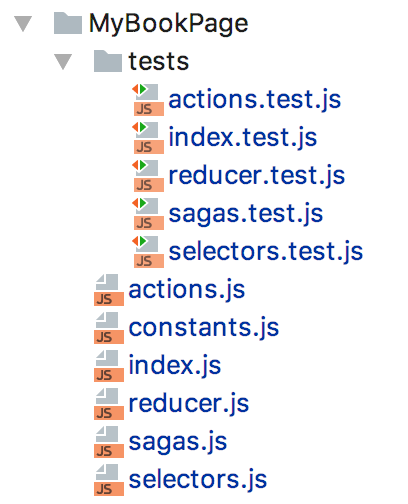
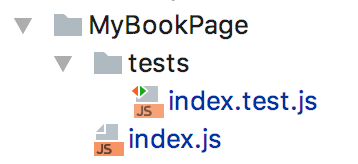

# React Resaga [](https://codecov.io/gh/QuanDhz/resaga) [](https://travis-ci.org/QuanDhz/resaga)

A reusable Reducer and Saga HOC library

## Why resaga?
By definition, `redux-saga` is a library that aims to make side effects (i.e. asynchronous things like data fetching and impure things like accessing the browser cache) in React/Redux applications easier and better. (Source: https://github.com/redux-saga/redux-saga)
 
The work cycle is a brilliant idea and works all great. My only concern is that we need to touch at least 4 files (`actions, reducer, sagas, selectors`) to get a simple feature working. Yes, that is not exaggerating.
Furthermore, it's likely that you're going to write a lot of tests to cover those 4 files

For example, say we need a `MyBookPage` component that do 1 job:
- Get all books every time we mount the component (Backend API: `GET /api/books`)

Then our component will look similar to this with `redux-saga`


What if I handle everything for you, and all you need to do is to tell `resaga`:
- when to start fetching (dispatch action)
- where to fetch (endpoint to call in saga)
- what to do when server returns result

Then your component will only look like this:


If you use redux-dev-tool in Chrome, time-travel debugging is also available


So, you get the best of `redux-saga` world, without writing any reducer nor sagas code.

## I'm interested, tell me how to get started

### Install

```bash
npm install --save resaga
```

## Basic Usages
### Wrap your component by resaga HOC
```js
// MyBookPage.js
export class MyBookPage extends PureComponent {
  // ...
}

const configs = {
  page: 'MyBookPage',
  submit: {
    getBooks: () => fetch('get', '/api/books'),
  },
};
export default resaga(MyBookPage, configs);
```
- `configs.page`: unique, work as an identification
- `submit.getBooks`: tell resaga what to do when 'getBooks' is dispatched
- `resaga(MyBookPage, configs)` wrap MyBookPage by resaga HOC with your own configs

### Use the injected props
Props `resaga` will be attached to `MyBookPage` component
```js
// MyBookPage.js
componentDidMount = () => this.props.resaga.dispatch('getBooks');
componentWillReceiveProps = (nextProps) =>
  this.props.resaga.analyse(
    nextProps,
    { getBooks: { onSuccess: this.getBooksSuccess } }
  );
getBooksSuccess = (books) => {
  // will be called when server returns some results
}
```

### Inject resaga reducer and sagas to your route
This is based on reactboilerplate `routes.js` file
```js
const myBookPage = 'MyBookPage'; // should match `configs.page` that we set in the beginning
<Route
  path={'/books'}
  name={'My Book Page'}
  getComponent={(nextState, cb) => {
    const importModules = Promise.all([
      import('resaga'),
      import('containers/MyBookPage'),
    ]);

    const renderRoute = loadModule(cb);
    
    importModules.then(([resaga, component]) => {
      const reducer = resaga.reducer(myBookPage);
      injectReducer(myBookPage, reducer);
      injectSagas(resaga.sagas);
      renderRoute(component);
    });

    importModules.catch(errorLoading);
  }}
/>
```
## API
### `resaga.dispatch`
```
handleSubmit = () => {
  this.props.resaga.dispatch(book, 'createBook');
};
```
your `configs` might look like this
```js
const configs = {
  page: 'MyBookPage',
  submit: {
    getBooks: () => fetch('get', '/api/books'),
    createBook: (book) => fetch('post', '/api/books', book),
  },
};
```
### `resaga.analyse`: utility function, to be used in `componentWillReceiveProps`, using this function ensures that every submission only return value once
```
componentWillReceiveProps = (nextProps) => 
    this.props.resaga.analyse(nextProps, {
      'getBooks': { onSuccess: this.getBooksSuccess, onError: getBooksError },
      'createBook': this.createBookWillReceiveProps, // return both success and error
    }
);
```
First parameter is `nextProps`, second parameter is config object:
- `onSuccess`which function to be called when saga return success.
- `onError`: which function to be called when saga return error.
- `manuallyAcknowledge (default: false)`:  whether the HOC should automatically acknowledge (see below).
### `resaga.acknowledge`: acknowledge by cleaning up redux data of a request
```
createBookWillReceiveProps = (...) => {
  this.props.resaga.acknowledge('createBook');
  ...
}
```
### `resaga.cleanup`: clear the whole page in redux data store. By default, this will be automatically called on `componentWillUnmount` if `MANUALLY_CLEANUP` in CONFIG is not set to true (default: false).
```
// manually clean up
this.props.resaga.cleanup('MyBookPage');
```

## Tests!

Run them:
`npm test`

Check coverage:
`npm run coverage`

## Scripts
Run with `npm run <script>`.

### release
Takes the same argument as `npm publish`, i.e. `[major|minor|patch|x.x.x]`, then tags a new version, publishes, and pushes the version commit and tag to `origin/master`. Usage: `npm run release -- [major|minor|patch|x.x.x]`. Remember to update the CHANGELOG before releasing!

### build
Runs the build scripts detailed below.

### build:component
Transpiles the source in `lib/` and outputs it to `build/`, as well as creating a UMD bundle in `dist/`.

### test
Runs the test scripts detailed below.

### test:lint
Runs `eslint` on the source.

### test:jest
Runs the unit tests with `jest`.

### coverage
Runs the unit tests and creates a code coverage report.
